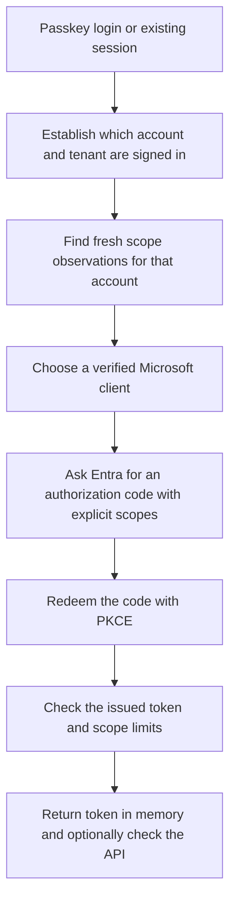

# From login to an access token

TokenForge reuses an authorized Entra sign-in session to request tokens through selected Microsoft first-party clients. Memory-only is the default. An [opt-in encrypted vault](session-vault.md) can save named ESTS sessions and acquired tokens; there is no background broker service. Entra issues the tokens and decides whether the request is authorized.

The normal scoped flow is:



## 1. Know what we are requesting

There are three separate choices:

| Choice | Example | Meaning |
| --- | --- | --- |
| Client application | A Microsoft first-party client ID | The application identity used to request the token |
| Resource API | Microsoft Graph | The API that will receive and accept the access token |
| Delegated scopes | `User.Read` | The permissions requested at that API, on behalf of the signed-in user |

The resulting token is for the resource API. A client may already have consent or resource-owner preauthorization for those scopes, making it a useful candidate. TokenForge does not launch that client application's product or modify a token to add permissions.

## 2. Load the planning information

Before requesting a token, TokenForge loads an inventory and a scope database. These are metadata, not saved credentials:

- Public sources suggest client IDs, resource IDs, scope relationships, and callback URLs.
- Tenant inventory records registered applications, Microsoft ownership, enablement, and readable configured grants.
- Private observations record which scopes Entra previously issued for a particular account, tenant, client, and resource.

`Get-TokenForgeScopeCandidates` compares these sources without logging in or requesting tokens. Published scope hints are not proof of consent. Missing grant visibility is unknown, not proof that no authorization exists. The scoped acquisition command requires fresh matched observations; the existing discovery workflow supplies those observations.

## 3. Establish a sign-in session

Choose one of these paths:

**Software passkey.** TokenForge calls the optional XDRInternals authentication helper. The helper reads the local passkey credential, obtains an Entra challenge, signs it, and submits the passkey assertion. Its temporary login session collects cookies in memory. It returns a selected ESTS session-cookie value to TokenForge, rather than returning the whole cookie collection. TokenForge wraps that value in `SecureString`. This command does not register a new passkey or save a new cookie file.

**Existing ESTS cookie.** You provide an `ESTSAUTH` or `ESTSAUTHPERSISTENT` cookie value as `SecureString`. TokenForge uses that existing session. It leaves the supplied object under your control so you can reuse it and dispose of it yourself.

**System browser.** The browser uses its own existing Entra session. TokenForge does not read, copy, or export browser cookies. It receives an authorization code through a temporary localhost callback. Browser cookies may persist in the browser profile according to the browser's own settings.

The scoped command requires silent authorization, including in browser mode. If Entra needs sign-in, MFA, account selection, or new consent during token acquisition, the request stops. Separately, the lower-level `Get-TokenForgeToken -Browser` and CLI `Connect` permit deliberately interactive sign-in and can show consent; add `-NoConsent` there to require an existing session.

## 4. Confirm the account before choosing scope candidates

The scoped command first requests a temporary Microsoft Graph `User.Read` token. It checks the token's reported tenant, account, client, and audience, then calls Graph `/me` to confirm that the account matches.

This prevents an inventory collected by an administrator from being mistaken for evidence about the account currently signing in. After confirmation, TokenForge uses the current account's fingerprint to select observations and pins subsequent requests to the confirmed tenant. It disposes of the temporary bootstrap access token and any bootstrap refresh token.

The bootstrap token is not exchanged for the final token. It is used only to establish account context.

Entra can include extra scopes in this temporary token. `MaxBootstrapAdditionalScopes` controls its actual scope breadth separately from the final token. The compatible default bootstrap client can return a broad token. Choose a validated narrow `BootstrapClientId` and set the bootstrap cap to zero when that matters. See the [tested alternatives](scope-token-workflow.md).

## 5. Choose a client with fresh observed coverage

TokenForge looks for recent, context-matched observations that contain all the requested scopes for this account and resource. It ranks clients by extra observed API scopes and skips disabled, missing, or unverified client records and unsupported callbacks.

Discovery may have obtained a broad token using `.default`; that does not prove a later explicit request will be equally broad. Discovery guides selection. The final issued token determines whether the requested scope limit is satisfied.

The scoped command bounds the number of client and callback attempts. It does not automatically register applications or add consent. A newer failed observation does not revive an older success.

## 6. Request a code, then redeem it for tokens

For each selected client, TokenForge sends Entra an authorization request containing the client ID, target resource's explicit scopes, published callback, a random `state` value, and a PKCE challenge.

In cookie mode, each token request creates a new in-memory HTTP cookie container. It adds the supplied ESTS cookie for the identity host. The same original cookie value can authenticate the bootstrap and subsequent client requests, but their HTTP containers are separate. Responses can update that request's temporary container; TokenForge does not save the updated jar or return it as a cache. Opt-in vault capture saves the original supplied cookie under its exact name.

In browser mode, the browser sends its own cookies and returns the code to TokenForge's temporary loopback listener.

Both scoped paths use `prompt=none`. Entra either authorizes the request using existing consent/preauthorization and session conditions or returns an error. There is no automatic interactive consent retry.

TokenForge checks the returned `state`, then sends the short-lived authorization code and original PKCE verifier to Entra's token endpoint. PKCE ties code redemption to the process that created the challenge. Entra returns an access token and, when requested with `-OfflineAccess` and issued by Entra, a refresh token. This is the [OAuth authorization-code flow](https://learn.microsoft.com/en-us/entra/identity-platform/v2-oauth2-auth-code-flow); the session cookie establishes sign-in, while the code is the credential redeemed for tokens.

TokenForge obtains a new token for each selected client/resource request. It does not exchange one application's access token for another application's access token in this workflow.

## 7. Check what Entra actually issued

The scoped command checks that the issued token reports the expected tenant, account, client, resource audience, and all requested delegated scopes. It checks extra scopes against `MaxAdditionalScopes` before returning the token. Set both scope caps to zero to require no extra API scopes in the bootstrap or final token; the defaults allow extras.

JWT decoding here is diagnostic: TokenForge does not validate the token signature locally. Graph identity confirmation and the optional API check are separate live evidence.

The optional API check sends the access token as a bearer credential to the selected resource. It sends the access token, not the ESTS cookie. An HTTP 403 is reported separately from successful token issuance: scopes alone do not establish API access, roles, licensing, or resource permissions.

Successful silent issuance establishes that this request completed without interaction. It does not identify whether tenant consent or Microsoft resource-owner preauthorization made that possible, and it does not prove the same client works in every tenant. Microsoft documents those [authorization mechanisms separately](https://learn.microsoft.com/en-us/entra/identity-platform/permissions-consent-overview).

## 8. Return and clean up

The caller receives access and optional refresh tokens as `SecureString` objects in memory. TokenForge disposes of failed tokens, its temporary bootstrap tokens, internally acquired cookie objects, HTTP clients, and browser callback listeners. Caller-supplied cookies and successfully returned tokens remain caller-owned.

Dispose of returned tokens when finished:

```powershell
try {
    # Use $token.AccessToken only for the intended API.
} finally {
    $token.AccessToken.Dispose()
    if ($token.RefreshToken) { $token.RefreshToken.Dispose() }
}
```

For later renewal, the lower-level token command can submit a caller-held refresh token with the same request. That uses the token endpoint directly and does not need the ESTS cookie. Automatic cross-client refresh discovery and automatic vault refresh rotation are not implemented; an opted-in scoped request can save its returned refresh token.

## What is saved, and how it is protected

| Material | Where it lives | Relevant protection |
| --- | --- | --- |
| Local software-passkey credential | Credential file on disk | Sensitive signing key material; restricted file/directory access. TokenForge does not encrypt the file or add hardware protection. |
| Passkey login cookies and TokenForge HTTP cookie containers | Process memory | Temporary containers; original supplied cookie can be explicitly saved in the encrypted vault |
| Browser session cookies | Browser memory/profile | Browser and OS protections; TokenForge neither manages nor audits that store |
| Authorization code and PKCE verifier | Process memory during authorization/redemption; the code also appears in the browser callback URL in browser mode | Matching state, PKCE, bounded callbacks and timeouts; browser history is controlled by the browser |
| Returned access/refresh tokens | Caller-owned process memory | `SecureString` interface and explicit disposal; persistence only through explicit vault options |
| Inventory and scope observations | Private JSON files | Whitelisted metadata, no token objects; account/tenant fingerprints still need privacy protection |

The current Linux credential and assessment directories were checked as owner-only (`0700`), and the working local passkey and checked state files as owner-readable/writable (`0600`). These permissions restrict other Unix accounts, not processes running as the same user or a privileged administrator. The adapter rejects linked passkey files and Unix files with group/other permissions. Those passkey checks are distinct from the new vault: vault paths enforce Unix permissions or protected Windows ACLs and passphrase encryption.

TokenForge's token transport confines identity redirects to the supported HTTPS identity host and captures published callbacks locally instead of sending codes to them. API checks stay on the selected Graph or ARM host and disable redirects. Identity errors are reduced to generic messages and bounded numeric codes. Observation storage whitelists metadata rather than serializing token objects.

Memory-only does not mean inaccessible or securely erased. The passkey helper, HTTP cookie containers, token responses, and bearer headers necessarily contain plaintext at runtime. `SecureString` reduces accidental display and supports disposal, but is not a security boundary against a compromised process; its internal storage is [not encrypted on non-Windows platforms](https://learn.microsoft.com/en-us/dotnet/api/system.security.securestring?view=net-10.0#how-secure-is-securestring). Clearing references and disposing objects does not guarantee erasure of every plaintext copy. PowerShell error history and external instrumentation can retain runtime information despite sanitized outward errors. A dedicated short-lived PowerShell process limits how long that runtime state remains available. Avoid transcripts, credential-valued command arguments, HTTP tracing, and full token-object logging.

Disposal is local cleanup. It does not revoke the Entra session, unregister the passkey, revoke issued tokens, or sign out the browser.

The [session vault guide](session-vault.md) explains the opt-in encrypted store, account isolation, expiry, concurrency, removal, and native CLI roadmap. OS-backed key protection is future work. The metadata database must not be used as a credential store.
